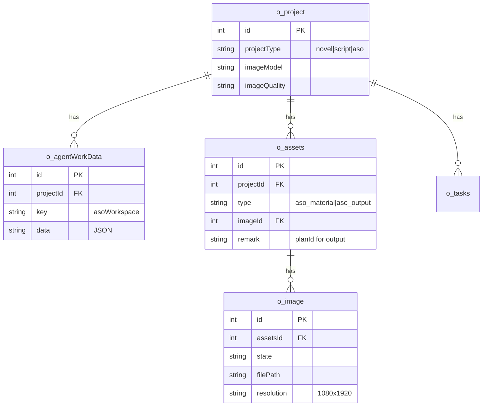

# Data Model: ASO 创作

**Date**: 2026-07-08  
**Branch**: `001-aso-creation`

---

## 1. 变更摘要

| 类型 | 变更 |
|------|------|
| 新表 | **无** |
| 表结构变更 | **无**（仅新增 `o_assets.type` / `o_image.type` 枚举值用法） |
| 新常量 | `projectTypes.ts`、`asoSizePresets.ts` |
| 新 Skill | `data/skills/aso_plan_generation.md` |
| 新路由域 | `src/routes/aso/*` |
| 新服务 | `src/services/aso/*`（workspace、planStream、imageGen） |

---

## 2. 实体关系



---

## 3. o_project（无 schema 变更）

### ASO 项目字段用法

| 字段 | 必填 | ASO 值示例 |
|------|------|-----------|
| `projectType` | ✅ | `'aso'` |
| `name` | ✅ | `"我的 App ASO"` |
| `intro` | ✅ | App 一句话描述 |
| `type` | ✅ | App 品类（沿用「小说类型」字段位） |
| `artStyle` | ✅ | 视觉风格（可默认「写实」） |
| `imageModel` | ✅ | `"1:gpt-image"` |
| `imageQuality` | ✅ | `"2K"` |
| `videoModel` | 传默认 | `""` 或占位 |
| `videoRatio` | 传默认 | `"16:9"` |
| `directorManual` | 传默认 | `""` |
| `mode` | ✅ | `"standard"` |

---

## 4. o_agentWorkData — asoWorkspace

### 行定位

```sql
SELECT * FROM o_agentWorkData
WHERE projectId = ? AND key = 'asoWorkspace';
```

### JSON Schema（逻辑）

```typescript
interface AsoWorkspace {
  version: 1;
  inputText: string;
  planCount: number;              // 默认 3，范围 1-10
  plans: AsoPlan[];
  selectedPlanId: string | null;
  referencedAssetIds: number[];   // 引用的 aso_material.id
  outputSizePreset: string;       // 默认 general_vertical_1080x1920
  outputs: AsoOutputRecord[];
  lastPlanGeneration?: {
    status: 'idle' | 'generating' | 'done' | 'error';
    errorReason?: string;
    updatedAt: number;
  };
}

interface AsoPlan {
  id: string;           // plan_{timestamp}_{index}
  title: string;
  copy: string;
  edited: boolean;
  createdAt: number;
  updatedAt: number;
}

interface AsoOutputRecord {
  planId: string;
  assetId: number;      // aso_output 资产 id
  imageId: number;
  presetId: string;
  width: number;
  height: number;
  state: '生成中' | '已完成' | '生成失败';
  errorReason?: string;
  createdAt: number;
}
```

### 默认初始化

创建 ASO 项目或首次 `getWorkspace` 时 insert：

```json
{
  "version": 1,
  "inputText": "",
  "planCount": 3,
  "plans": [],
  "selectedPlanId": null,
  "referencedAssetIds": [],
  "outputSizePreset": "general_vertical_1080x1920",
  "outputs": [],
  "lastPlanGeneration": { "status": "idle", "updatedAt": 0 }
}
```

---

## 5. o_assets 类型扩展

### aso_material（导入/变体素材）

| 字段 | 值 |
|------|-----|
| `type` | `'aso_material'` |
| `materialKind` | `'image'` \| `'text'`（存 remark 或 JSON 扩展字段） |
| `name` | 文件名或用户命名 |
| `describe` | 描述；文字素材时为主要内容 |
| `projectId` | 项目 ID |
| `prompt` | 空或 AI 描述 |
| `imageId` | 图片素材关联 o_image；文字素材为 null |

### aso_output（成品 ASO 图）

| 字段 | 值 |
|------|-----|
| `type` | `'aso_output'` |
| `name` | `ASO-{presetId}-{timestamp}` |
| `remark` | `planId` |
| `prompt` | 出图时使用的合成 prompt |
| `projectId` | 项目 ID |

---

## 6. o_image

| 字段 | ASO 用法 |
|------|---------|
| `type` | `aso_material` / `aso_output` |
| `state` | `生成中` / `已完成` / `生成失败` |
| `filePath` | `/{projectId}/aso/material|output/{uuid}.png` |
| `resolution` | `"1080x1920"` 等 |
| `errorReason` | 失败信息 |

---

## 7. o_tasks

| taskClass | describe 示例 |
|-----------|--------------|
| `ASO方案生成` | 生成 3 套创意方案 |
| `ASO图生成` | 方案 plan_xxx → 1080×1920 |
| `ASO参考图变体` | 基于素材 #101 生成 4 张变体 |

`relatedObjects` JSON：`{ projectId, planId?, assetIds?, presetId? }`

---

## 8. 尺寸预设常量

见 `src/constants/asoSizePresets.ts`（与 clarify.md 一致，共 12 项）。

每项结构：

```typescript
interface AsoSizePreset {
  id: string;
  label: string;
  width: number;
  height: number;
  platform: 'ios' | 'android' | 'general';
  category: 'preview' | 'screenshot' | 'icon' | 'feature' | 'promo';
  aspectRatio: `${number}:${number}`;
  sizeTier: '1K' | '2K' | '4K';
  default?: boolean;
}
```

---

## 9. 项目类型注册

```typescript
// src/constants/projectTypes.ts
export type ProjectTypeValue = 'novel' | 'script' | 'aso';

export function isAsoProject(projectType: string | null | undefined): boolean {
  return projectType === 'aso';
}

export function assertAsoProject(project: { projectType?: string | null }) {
  if (!isAsoProject(project.projectType)) {
    throw new Error('该项目不是 ASO 类型');
  }
}
```

---

## 10. 数据生命周期

| 操作 | 行为 |
|------|------|
| 创建 ASO 项目 | insert o_project + 初始化 asoWorkspace |
| 上传图片素材 | insert o_assets(materialKind=image) + o_image + OSS |
| 添加文字素材 | insert o_assets(materialKind=text)，无 o_image |
| 生成方案 | 更新 workspace.plans[] |
| 编辑方案 | 更新 plans[i].copy, edited=true |
| 生成 ASO 图 | insert aso_output + o_image + outputs[] |
| 删除素材 | del assets + image + OSS；从 referencedAssetIds 移除 |
| 删除项目 | 现有 delProject 级联（已覆盖） |

---

## 12. 账号模型（Out of Scope）

**不实现多账号。** 与原版 Toonflow 一致：

- 登录：`admin` / `admin123`（可改密码）
- JWT 鉴权保留；`o_project.userId` 维持现状（可写死 `1`）
- 项目列表全员共享；ASO 仅校验 `projectType`

~~原「多用户与并发」章节已取消，详见 [clarify-multiuser.md](./clarify-multiuser.md)。~~

---

## 14. Vision 模型配置

| o_agentDeploy.key | 名称 | 用途 |
|-------------------|------|------|
| `universalAi` | 通用AI | 纯文本方案生成 |
| `asoVisionAi` | ASO 图片理解 | 含图片素材的方案生成（多模态 messages） |

项目级 `imageModel` 仍用于 ASO 出图与参考图变体。

---

无需新索引。高频查询：

1. `o_agentWorkData (projectId, key='asoWorkspace')`
2. `o_assets (projectId, type='aso_material')`
3. `o_assets (projectId, type='aso_output')`
4. `o_image (id) WHERE state != '生成中'` — 轮询
