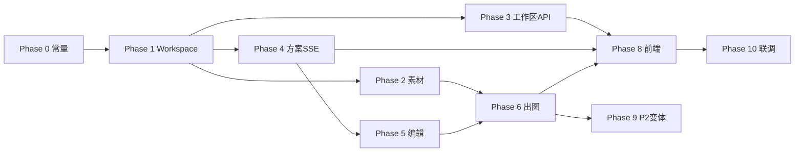

# Implementation Plan: ASO 创作项目类型

**Branch**: `001-aso-creation` | **Date**: 2026-07-08 | **Spec**: [spec.md](./spec.md)

**Input**: Feature specification from `/specs/001-aso-creation/spec.md` + [clarify.md](./clarify.md)

---

## Summary

在 Toonflow 中增量新增 **`aso`（ASO 创作）** 项目类型及独立 REST 工作流（SSE 方案 → 编辑 → 出图）。**不实现多账号**；账号/鉴权与原版一致（单 admin + JWT）。复用现有表结构，不影响 novel/script。

---

## Technical Context

| 项 | 值 |
|----|-----|
| **Language** | TypeScript 5.x / Node.js 23+（开发环境 v22 可用） |
| **Backend** | Express 5、Knex、SQLite、Zod、Vercel AI SDK |
| **Frontend** | Vue 3 + TDesign（**Toonflow-web** 仓库） |
| **Storage** | SQLite + `data/oss/` 文件 |
| **AI** | `universalAi` + **`asoVisionAi`** + `u.Ai.Image(project.imageModel)` |
| **Frontend repo** | **`E:\workflow\toonflow-web`**（用户 fork，与 app 并列） |
| **Image post** | `sharp`（`src/utils/image.ts`） |
| **Auth** | JWT 单账号（admin），与原版一致 |
| **Streaming** | SSE（新建） |
| **Testing** | 手动 curl + 回归 |

---

## Constitution Check

| 原则 | 状态 | 说明 |
|------|------|------|
| I 不破坏现有功能 | ✅ PASS | 新路由域 + projectType 门控 |
| II 数据复用 | ✅ PASS | 零新表 |
| III 可扩展 projectType | ✅ PASS | `projectTypes.ts` 注册表 |
| IV API 约定 | ✅ PASS | Zod + 文件路由 |
| V 前后端边界 | ✅ PASS | contracts 先行 |
| VI AI 输出规范 | ✅ PASS | 结构化 plan + 任务状态 |
| VII 安全隔离 | ✅ PASS | JWT + projectType 门控（无 userId 隔离） |
| VIII 简洁交付 | ✅ PASS | 1 service 层 + 薄路由；P2 变体后置 |
| IX 可观测 | ✅ PASS | o_tasks 记录 |

**Gate**: 全部通过，可进入实现。

---

## Project Structure

### Documentation（本 feature）

```text
specs/001-aso-creation/
├── spec.md
├── clarify.md
├── research.md
├── data-model.md
├── plan.md              ← 本文件
├── quickstart.md
├── tasks.md             ← 细粒度任务（/speckit.tasks 输出）
└── contracts/
    └── aso-api.md
```

### Source Code（Toonflow-app）

```text
src/
├── constants/
│   ├── projectTypes.ts       # NEW
│   └── asoSizePresets.ts     # NEW
├── services/
│   └── aso/
│       ├── workspace.ts      # NEW — CRUD asoWorkspace
│       ├── planGenerator.ts  # NEW — 流式/非流式方案
│       ├── imageGenerator.ts # NEW — 出图 + resize
│       ├── sse.ts            # NEW — SSE 工具
│       └── types.ts          # NEW — AsoWorkspace 类型
├── routes/
│   └── aso/                  # NEW — 12 个路由文件
├── middleware/
│   └── assertAsoProject.ts   # NEW（可选，仅校验 projectType）
data/
└── skills/
    └── aso_plan_generation.md  # NEW
```

### Source Code（Toonflow-web — 用户 fork）

**路径**: `E:\workflow\toonflow-web\`（clone from upstream Toonflow-web）

```text
src/
├── views/workbench/
│   └── aso/
│       ├── AsoWorkbench.vue
│       ├── InputPanel.vue
│       ├── PlanList.vue
│       ├── MaterialGrid.vue      # 图片 + 文字素材
│       ├── OutputGallery.vue
│       └── SizePresetSelect.vue
├── api/aso.ts
└── locales/zh-CN/workbench.ts  # basedOnAso i18n
```

**Structure Decision**: 后端集中在 `services/aso` + `routes/aso`；前端独立页面树，按 `projectType` 路由分叉。

---

## Implementation Phases

### Phase 0 — 基础常量与类型（0.5d）

**目标**：可被路由引用的共享定义，无业务逻辑。

| # | 任务 | 产出 |
|---|------|------|
| 0.1 | 创建 `projectTypes.ts` | `ProjectTypeValue`、`isAsoProject`、`PROJECT_TYPES` |
| 0.2 | 创建 `asoSizePresets.ts` | 12 项预设 + `getPresetById()` + `getDefaultPreset()` |
| 0.3 | 创建 `services/aso/types.ts` | `AsoWorkspace`、`AsoPlan`、`AsoOutputRecord` Zod schema |
| 0.4 | 创建 `aso_plan_generation.md` | Skill 提示词：输出 N 套 title+copy，JSON/XML 格式 |

**验收**：`yarn lint` 通过；常量可被 import。

---

### Phase 1 — 工作区服务层（1d）

**目标**：asoWorkspace 读写闭环。

| # | 任务 | 产出 |
|---|------|------|
| 1.1 | `workspace.getOrCreate(projectId)` | 无行则 insert 默认 JSON |
| 1.2 | `workspace.get(projectId)` | 返回 workspace + 校验 ASO 项目 |
| 1.3 | `workspace.patch(projectId, partial)` | merge patch + updateTime |
| 1.4 | `workspace.addPlan / updatePlan / setPlans` | plans 数组操作 |
| 1.5 | `workspace.addOutput / updateOutputState` | outputs 记录 |
| 1.6 | `assertAsoProject(projectId)` | projectType === 'aso' |

**验收**：单元手动测试 — insert 后 get 返回默认结构。

---

### Phase 2 — 素材 API（0.5d）

**目标**：图片导入、列表、删除。

| # | 任务 | 路由 | 要点 |
|---|------|------|------|
| 2.1 | 上传素材 | `uploadMaterial.ts` | base64 → OSS → o_assets(aso_material) + o_image |
| 2.2 | 列表 | `listMaterials.ts` | join o_image，返回 filePath 缩略图 URL |
| 2.3 | 删除 | `deleteMaterial.ts` | 删 OSS + DB；patch referencedAssetIds |

**复用参考**：`routes/assets/saveAssets.ts`、`delAssets.ts`

**验收**：上传后 listMaterials 可见；delete 后 workspace 引用同步。

---

### Phase 3 — 工作区 HTTP（0.5d）

| # | 任务 | 路由 |
|---|------|------|
| 3.1 | 读工作区 | `getWorkspace.ts` |
| 3.2 | 存工作区 | `saveWorkspace.ts` |
| 3.3 | 尺寸预设 | `getSizePresets.ts` |

**验收**：Postman 读写 inputText、outputSizePreset、referencedAssetIds。

---

### Phase 4 — 创意方案生成（1.5d）

**目标**：SSE 流式为主，非流式降级。

| # | 任务 | 说明 |
|---|------|------|
| 4.1 | `services/aso/sse.ts` | `writeSse(res, event, data)`、`endSse(res)` |
| 4.2 | `planGenerator.buildPrompt()` | inputText + 素材（Vision base64 或文字 describe）+ planCount |
| 4.2a | `asoVisionAi` deploy 槽 | initDB seed + 设置中心可选 Vision 模型 |
| 4.3 | `planGenerator.streamPlans()` | 有图 → `asoVisionAi` 多模态 stream；无图 → `universalAi` |
| 4.4 | 流式 JSON/XML 解析器 | 增量提取 title/copy；每套 plan_done |
| 4.5 | `generatePlansStream.ts` | POST SSE 路由；req.on('close') 中止 |
| 4.6 | `planGenerator.generatePlans()` | 非流式 invoke + 一次性 parse |
| 4.7 | `generatePlans.ts` | 降级路由 |
| 4.8 | `u.task()` 记录 | taskClass=`ASO方案生成` |
| 4.9 | 持久化 | all_done 时 workspace.setPlans + lastPlanGeneration |

**验收**：
- curl 看到 plan_delta 事件
- 刷新 getWorkspace plans 有 3 条
- 无文本无图 → 400

---

### Phase 5 — 方案编辑（0.25d）

| # | 任务 | 路由 |
|---|------|------|
| 5.1 | `updatePlan.ts` | 更新 title/copy，edited=true |

**验收**：编辑后 generateAsoImage 使用新 copy。

---

### Phase 6 — ASO 出图（1.5d）

**目标**：方案 + 素材 + 尺寸 → 异步成品。

| # | 任务 | 说明 |
|---|------|------|
| 6.1 | `imageGenerator.buildPrompt()` | plan.copy + artStyle + preset 用途 |
| 6.2 | `imageGenerator.loadReferenceBase64(assetIds)` | 从 OSS 读图转 base64 |
| 6.3 | `imageGenerator.generate()` | Ai.Image.run → 临时文件 |
| 6.4 | `sharp resizeImage` | 精确到 preset width×height |
| 6.5 | 写 OSS + o_assets(aso_output) + o_image | state 流转 |
| 6.6 | `generateAsoImage.ts` | 立即返回 imageId；**409 若 planId 进行中**；后台 async 生成 |
| 6.7 | `pollingOutputs.ts` | 仿 pollingImageAssets |
| 6.8 | workspace.outputs[] 同步 | 生成中→已完成/失败 |

**验收**：
- 默认 1080×1920
- 切换 ios_screenshot_65 → 1242×2688
- 失败有 errorReason，可重试

---

### Phase 7 — 项目类型入口（0.5d — 后端）

| # | 任务 | 说明 |
|---|------|------|
| 7.1 | addProject 后可选 hook | ASO 项目 create 时 init workspace（或在 getOrCreate 懒初始化） |
| 7.2 | 文档注释 | addProject 接受 projectType=`aso` |

**说明**：addProject **不改 schema**，已支持任意 string。

---

### Phase 8 — 前端 Toonflow-web（2–3d）

| # | 任务 | 组件/文件 |
|---|------|----------|
| 8.1 | i18n | `basedOnAso: 'ASO 创作'` 各语言 |
| 8.2 | 创建项目下拉 | 第三项 value=`aso`；隐藏 video 相关表单项 |
| 8.3 | 项目路由 | `projectType==='aso'` → AsoWorkbench |
| 8.4 | InputPanel | 文本框 + 方案数 + 上传 + 生成按钮 |
| 8.5 | SSE 客户端 | fetch stream 解析 / 降级调用 generatePlans |
| 8.6 | PlanList | 卡片列表 +  inline 编辑 + 选中 |
| 8.7 | MaterialGrid | 缩略图 + 勾选引用 |
| 8.8 | SizePresetSelect | 分组下拉 iOS/Android/通用 |
| 8.9 | 生成 ASO 图按钮 | 调 generateAsoImage + 轮询 |
| 8.10 | OutputGallery | 历史成品 + 预览 + 下载 |
| 8.11 | api/aso.ts | 封装全部 ASO 接口 |

**验收**：UI 完整走通 SC-001 五分钟流程。

---

### Phase 9 — P2 参考图变体（1d，可后置）

| # | 任务 | 路由 |
|---|------|------|
| 9.1 | `generateRefVariants.ts` | count 张变体，入库 aso_material |
| 9.2 | 前端「生成变体」按钮 | 辅助面板 |

---

### Phase 10 — 联调、回归与发布（1d）

| # | 任务 |
|---|------|
| 10.1 | novel/script 项目全流程回归 |
| 10.2 | ASO 删除项目 → OSS 清理 |
| 10.3 | 构建 Toonflow-web → 更新 data/web |
| 10.4 | Electron `yarn dev:gui` 验证 |
| 10.5 | 更新 README / 内部分支文档 |

---

## 依赖关系（Critical Path）



**MVP 范围**：Phase 0–8 + 10（不含 Phase 9；不含多用户 Phase −1）

**预估工时**：后端 ~5d + 前端 ~2.5d + 联调 ~1d ≈ **8–9 人日**

---

## 风险与降级策略

| 风险 | 降级 |
|------|------|
| SSE 在 Electron 异常 | 前端检测失败自动调 `/generatePlans` |
| 流式解析不稳定 | v1 先 ship 非流式，SSE 作为增强 |
| 未配置 asoVisionAi | 降级文本描述 + universalAi，UI 提示配置 Vision 模型 |
| 模型不支持参考图 | 隐藏图片 referenceList，纯文案+文字素材出图 |
| 前端仓库未就绪 | **Phase 0 T000** clone Toonflow-web 到 `E:\workflow\toonflow-web` |

---

## Complexity Tracking

无 Constitution 违规，无需填表。

---

## 相关文档

- [research.md](./research.md) — 技术调研
- [data-model.md](./data-model.md) — 数据模型
- [contracts/aso-api.md](./contracts/aso-api.md) — API 契约
- [tasks.md](./tasks.md) — **可执行任务清单（带 ID）**
- [quickstart.md](./quickstart.md) — 开发上手

---

## 下一步

执行 **`/speckit.implement`** 或按 [tasks.md](./tasks.md) 逐项实施。
